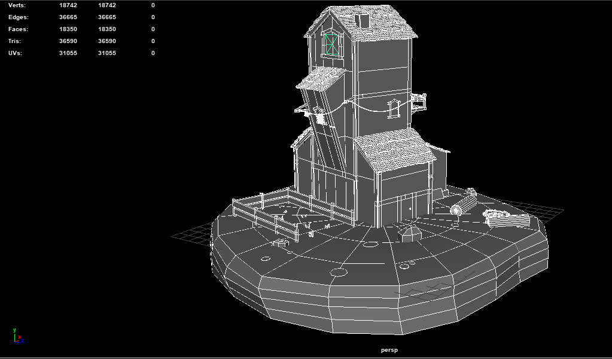
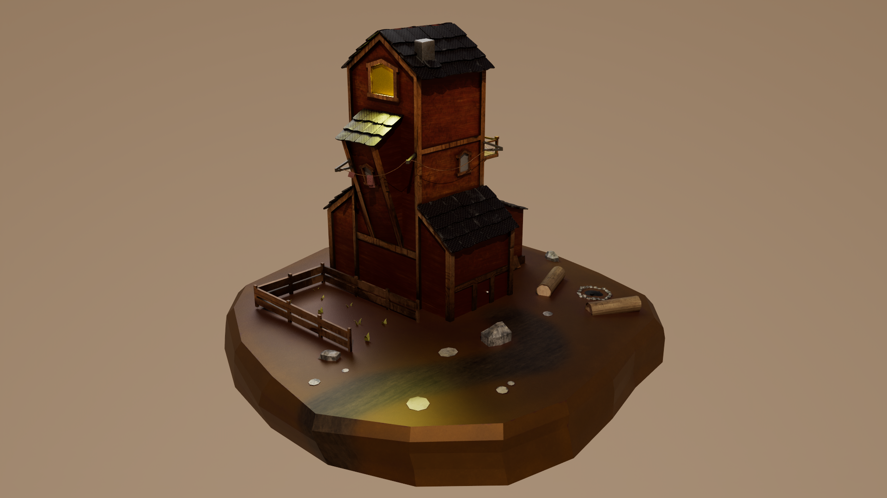
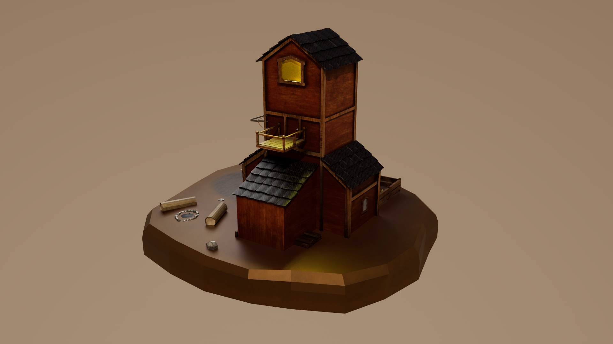

# Tourangeau mikael

# coordonnées

**nom:** Tourangeau Mikael

**adresse:** 1011 Rue des jacinthes, Laval

**adresse de courriel:** miktourangeau@gmail.com

**téléphone:** 438-870-3223

# objectif de carrière

M’améliorer dans le domaine du multimédia en obtenant de l’expérience dans le marché du travail pour me développer au sein d’une équipe. j'aime particulièrement la 3D.

# compétences

## Maya 

- modélisation

- uv

- rigging

- skinning

- animation

## Substance

- texture

## davinci resolve

- Montage

- colorisation

## Photoshop

- retouche

- graphisme

# réalisations

## Idari

 Idari est un projet d'environnement 3D inspiré des projets 3D de mini environnement. J'ai utilisé Maya pour la modélisation et les UV, ainsi que Substance pour les textures.

## Biota

Biota est un projet 3D et sonore, le thème était "espace empathique". J'ai fait le générique, dirigé la modélisation du projet, fait le montage et fait l'animation des couleurs.

