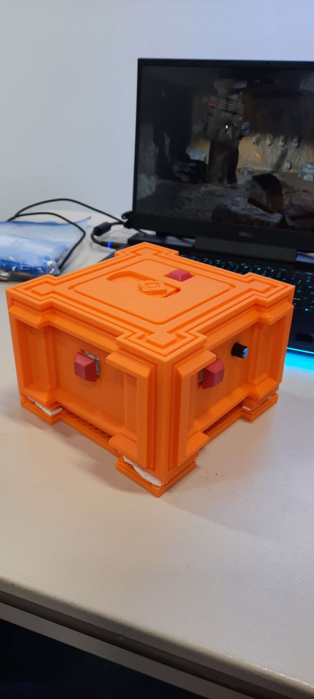
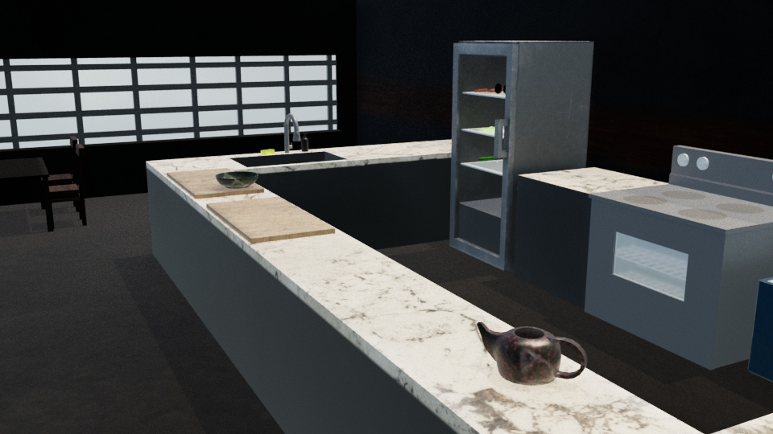

# Tourangeau mikael

# Coordonnées

**nom:** Tourangeau Mikael

**adresse:** Laval

**adresse de courriel:** miktourangeau@gmail.com

**téléphone:** 438-870-3223

# Objectif de carrière

M’améliorer dans le domaine du multimédia en obtenant de l’expérience dans le marché du travail pour me développer au sein d’une équipe. j'aime particulièrement la 3D.

# Compétences

## Maya 

- modélisation

- uv

- rigging

- skinning

- animation

## Substance

- texture

## Davinci resolve

- Montage

- colorisation

## Photoshop

- retouche

- graphisme

## Unity

- création de jeux

- assemblage de scène

# réalisations

## Le temple prismatique

Le temple prismatique est un mini-jeux interactif avec le thème d'«escape game». L'utilisateur cherche à résoudre les énigmes à l'intérieur du temple grâce à plusieurs boutons qui se trouve au-dessus d'une boîte qui représente ce temple. J'ai fait tous les éléments de la scène 3D, j'ai fait une impression 3D de la boîte et j'ai assisté à la conception des énigmes dans Unity. Les logiciels utilisés sont: Maya, substances, Unity, Max 8 et arduino.

## Esprit gourmand

Esprit gourmand est un jeu en réalité virtuel qui est inspiré des jeux de cuisine. Le but du jeu est de cuisiner des plats avec les bons ingrédients pour les servir aux clients. J'ai fait tous les éléments de la scène 3D et j'ai assisté à la conception des interactions dans Unity. Les logiciels utilisés sont: Maya, substances et Unity.

https://youtu.be/9wXB3eh3WQQ

## Idari

 Idari est un projet d'environnement 3D inspiré des projets 3D de mini environnement. J'ai utilisé Maya pour la modélisation et les UV, ainsi que Substance pour les textures.

## écazard

écazard est un projet de modélisation 3D. Je me suis inspiré de pokemon pour le personnage. J'ai utilisé Maya pour la modélisation, les UV, le rigging et le skinning ainsi que Substance pour les textures.

## Biota

Biota est un projet 3D et sonore, le thème était "espace empathique". Dans ce projet, les larmes du personnage redonnent vie à la nature. J'ai fait le générique, dirigé la modélisation du projet, fait le montage et fait l'animation des couleurs. Les logiciels utilisés sont: Maya, Davinci Resolve et Vcv rack.

https://youtu.be/zfSOsYgrSy4

## Contrôle

Contrôle est un projet de vidéo immersif grâce à 4 écrans. Dans ce projet, nous utilisons les quatres écrans pour amener le spectateur dans un univers surveillé et contrôlé. J'ai fait la majorité du montage vidéo. Le logiciel utilisé est Davinci Resolve.

https://youtu.be/n8h8BKFiObE

## Fluides

Fluides est un projet de vidéo macro. Dans ce projet, nous avons capturé de près plusieurs liquides pour en créer une oeuvre. J'ai fait la majorité du montage vidéo et j'ai dirigé le côté artistique du projet. Les logiciels utilisés sont: Davinci Resolve et Vcv rack.

https://youtu.be/fOd_5fhXbFg

## Logo Québec Avenir

Québec Avenir était un faux parti politique fait en cours d'art de convaincre. J'ai créé un logo pour notre parti qui démontrait aller de l'avant. Le logiciel utilisé est Photoshop.

